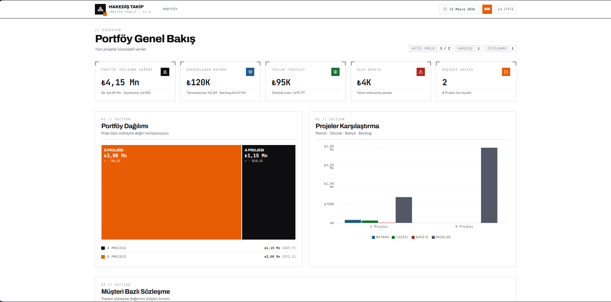
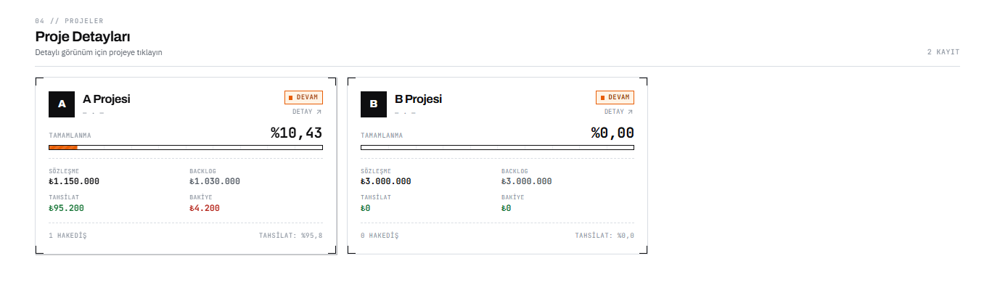
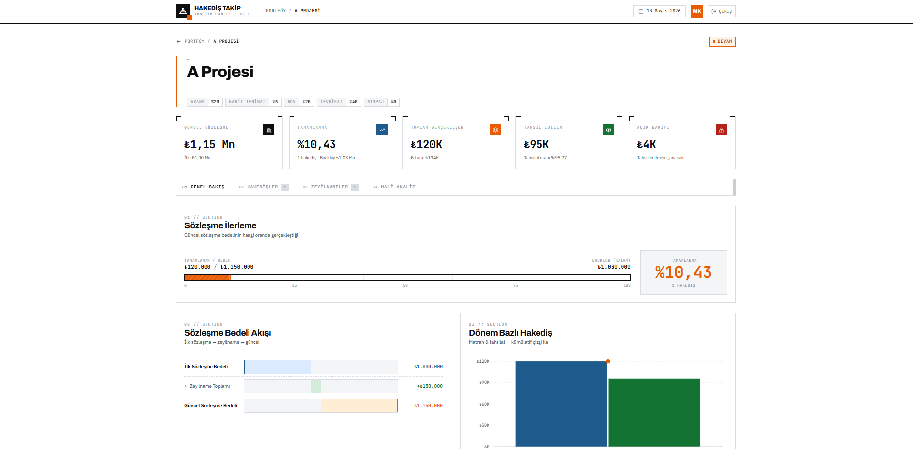

# Hakediş Takip

Inşaat sektörü için **canlı hakediş ve sözleşme takip dashboard'u**. Saha ekibinin Excel üzerinde tuttuğu verileri (proje sözleşmeleri, hakediş kalemleri, zeyilnameler) yöneticilere LAN üzerinden web arayüzünde sunar.

Gerçek bir iş probleminden doğdu: Excel dosyası bir kullanıcıdaydı, yöneticiler veriyi anlık göremiyordu. Bu uygulama Excel'i tek doğruluk kaynağı olarak korurken, üzerine read-only bir dashboard katmanı ekliyor.

## Ekran görüntüleri

**Portföy genel bakış** — tüm projelerin kümülatif KPI'ları, treemap dağılımı, karşılaştırma grafikleri



**Proje kartları** — her proje için tamamlanma oranı, sözleşme, backlog, tahsilat



**Proje detay** — 6 sekme: genel bakış, hakedişler, zeyilnameler, mali analiz, maliyet & SGK, cari ekstre. Sözleşme bedeli akışı (ilk → zeyilname → güncel) ve dönem bazlı hakediş grafiği. *(Ekran görüntüsü eski 4-sekme sürümünden — Maliyet & SGK ve Cari Ekstre sonradan eklendi, henüz güncellenmedi.)*



## Özellikler

- **Portföy görünümü** — tüm projelerin KPI'ları, treemap ve karşılaştırma grafikleri
- **Proje detay** — 6 sekme: Genel Bakış, Hakedişler, Zeyilnameler, Mali Analiz (waterfall + donut), Maliyet & SGK, Cari Ekstre (ana cari/sözleşme/avans hareketleri, yürüyen bakiye)
- **Otomatik yenileme** — 30 sn polling, Excel değiştiğinde dashboard'a yansır
- **JWT auth** — tek paylaşımlı kimlik, 8 saat oturum
- **Çoklu deploy modu** — Windows (tek makinede) veya Ubuntu (push mimarisi)

## Mimari

```
┌──────────────────┐                ┌──────────────────────────────┐
│  Windows PC      │                │  Ubuntu Sunucu (7/24)        │
│                  │                │                              │
│  Z:\RAPOR\       │  HTTP POST     │  Nginx :8080                 │
│  Hakedis.xlsx    │ ─────────────► │                              │
│        │         │  (her 30 sn)   │  ├─ /api/auth/login          │
│        ▼         │                │  ├─ /api/portfolio           │
│  gonoder.py      │                │  ├─ /api/project/{id}        │
│  (mtime watcher) │                │  └─ /api/internal/push-excel │
└──────────────────┘                │  → uvicorn :8000 (localhost) │
                                    │  → React build (statik)      │
                                    └──────────────────────────────┘
                                              ▲
                                              │ LAN
                                    ┌─────────┴─────────┐
                                    │  Tarayıcı (web)   │
                                    └───────────────────┘
```

İki ayrı subnet arasında SMB mount yapılamadığı için **push mimarisi** kullanıldı: Windows tarafındaki `gonoder.py` Excel'in `mtime`'ını izler, değiştiğinde dosyayı HTTP ile Ubuntu sunucusuna gönderir. Sunucu lokal kopyayı okuyup cache'ler.

## Stack

**Backend** — FastAPI 0.115, pandas, openpyxl, pydantic-settings, python-jose (JWT), passlib (bcrypt)

**Frontend** — React 18, Vite, TailwindCSS, Recharts, TanStack Query

**Deploy** — systemd, nginx, Ubuntu 22.04

## Kurulum

### 1. Backend ve frontend'i çalıştır (lokal Windows)

```bash
# Backend
cd backend
python -m venv venv
venv\Scripts\pip install -r requirements.txt
cp .env.example .env  # .env'i düzenle
venv\Scripts\uvicorn app.main:app --reload

# Frontend
cd frontend
npm install
npm run dev
```

### 2. Ubuntu deploy

```bash
# Sunucuda
sudo bash deploy/setup.sh

# Code değişikliklerinden sonra güncelleme
sudo bash deploy/update.sh
```

### 3. Push mekanizması (Windows tarafı)

```bash
cd gonoder
cp .env.example .env  # token + URL ayarla
python gonoder.py
```

## Klasör yapısı

```
hakedis-v2/
├─ backend/              FastAPI + Excel okuyucu
│  ├─ app/
│  │  ├─ routers/        portfolio, project, auth, health, internal
│  │  ├─ repositories/   excel_repo (mtime cache + stale fallback)
│  │  ├─ services/       calc (hakediş formül motoru)
│  │  └─ models/         pydantic şemaları
│  └─ requirements.txt
├─ frontend/             React + Vite
│  └─ src/
│     ├─ views/          PortfolioView, ProjectView + 4 tab
│     ├─ components/     KPICard, Treemap, Waterfall, Donut...
│     └─ hooks/          useAuth, useApi
├─ gonoder/              Excel mtime watcher → HTTP pusher
├─ deploy/               setup.sh, update.sh, nginx.conf, systemd
└─ baslat.bat            Windows tek-makine başlatıcı
```

## Notlar

- Excel'deki sütun isimleri kod tarafında `_PROJELER_RENAME` ve `_VERI_GIRISI_RENAME` dict'leriyle eşleniyor — yeni alan eklenirse bu sözlükler güncellenmeli
- Cache 5sn TTL, kaynak erişilemezse 5 dakikaya kadar stale data sunar
- Uygulama tek-tenant; multi-user/RBAC yok
